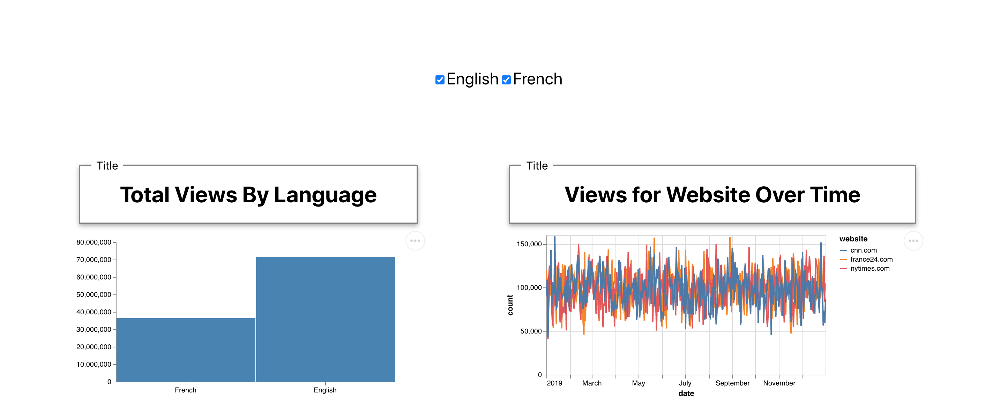

# Challenge

At Predata, we monitor what is happening on the internet. To do so, we track the
number of daily views different websites get. To group and relate websites to
each other, we assign "tags" to websites. Tags can represent things like a
language, a country, or an industry.

Your task is to complete the implementation of a user interface to
visualize the data - the frontend runs on `localhost:3000`.

Some starter code has been included in this challenge to give you a place to
begin development.

To run the react app, use `npm start`.

## User Interface

Below is the user interface we will develop. We are using React as our frontend
framework. You will need to fill out javascript functions, implement css and
build a react component to complete the UI to spec. **The final product should
match the image below.**

### Current Behavior:

- Language checkboxes:
  - Unchecked: website data for given language is hidden from data visualization
  - Checked: website data for given language is shown in data visualization

### To Implement:

#### Data Manipulation

- src/features/chart/chartSlice.js (javascript for the bar chart)
  - groupByLanguage

#### CSS

- src/App.module.css (component styling for App.js)
  - time_series\_\_header
  - time_series\_\_chart_row

#### React component

- src/features/chart/ChartHeader.js (react component to display the title of the charts)
- src/features/chart/Chart.module.css (component styling for ChartHeader)
    - header\_\_text
    - header\_\_label

If you're unsure where to look, just `grep` for `TODO`.

## REST API

You may not need this information, but for your reference, here is the [API
specification](api-spec.md) for the server this application communicates with.
The API is hosted at http://a64e87478b2e0426091e5939c97440e3-254114657.us-east-1.elb.amazonaws.com.
